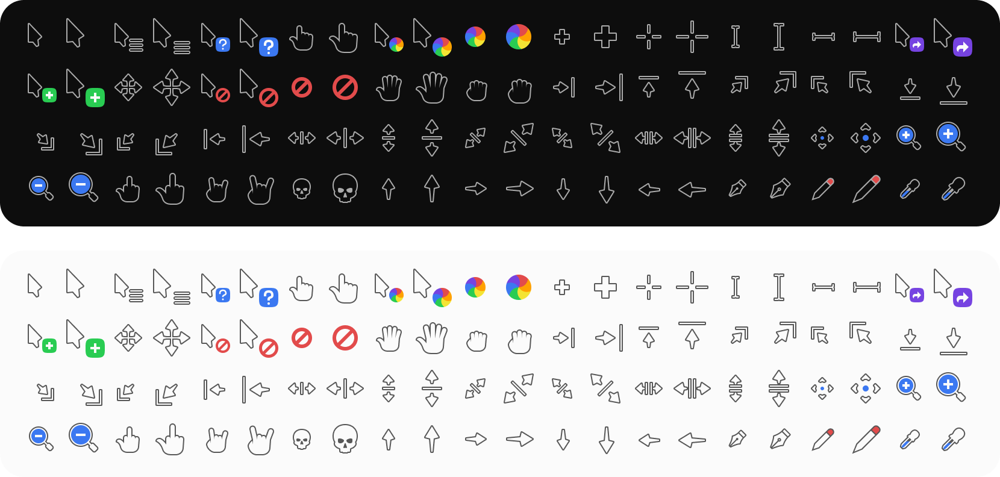

# Fringer Cursors

An extensive cursor theme for Linux distribution with some green, inspired by Menda cursor.

It is a hodge podge of the following:

- **Forked from:** [Phinger Cursors](https://github.com/phisch/phinger-cursors) by Philipp Schaffrath, a cursor theme with many different pointers and care for pixel-perfectness.
- **Build system:** [Cursor Theme Builder](https://github.com/phisch/cursor-theme-builder) also by Philipp Schaffrath, which made this fork trivial to do
- **Inspiration for color and some sprites:** [Menda XCursor](https://www.gnome-look.org/p/999589) by [anexation](https://github.com/anexation/menda-cursor), the cursor theme of Manjaro (also known as [Maia Cursor](https://gitlab.manjaro.org/artwork/cursors/maia-cursor) now?)
- **Color palette:** [Frogarized](https://git.frogeye.fr/geoffrey/dotfiles/src/branch/main/common/frogarized) which is my derivation of [Solarized](https://ethanschoonover.com/solarized/) by Ethan Schoonover but where the background is green rather than blue.

The name is a collapse of the original project name with Frogeye, as I usually do with thing I fork.



## How to install

### NixOS

Copy [the package definition from my dotfiles](https://git.frogeye.fr/geoffrey/dotfiles/src/branch/main/hm/desktop/cursor/default.nix),
then you can either add it to your `configuration.nix`:

<!-- TODO Permalink once dotfiles commit made -->

```nix
environment.systemPackages = fringer-cursors;
```

Or use it in your home-manager configuration:

```nix
home.pointerCursor = {
  name = "fringer-cursors-light";
  package = fringer-cursors;
  size = 32;
  gtk.enable = true;
};
```

### Manually

For a manual installation, download and extract the [latest release](https://github.com/phisch/fringer-cursors/releases/latest/download/fringer-cursors-variants.tar.bz2) into the `~/.local/share/icons` directory.

```sh
mkdir -p ~/.local/share/icons
wget -cO- https://github.com/phisch/fringer-cursors/releases/latest/download/fringer-cursors-variants.tar.bz2 | tar xfj - -C ~/.local/share/icons
```

This installs the cursor theme for your current user. To install for all users, extract into `/usr/share/icons` instead.

## How to enable

You might have a settings application installed that can do this for you like [GNOME Tweaks](https://gitlab.gnome.org/GNOME/gnome-tweaks), [nwg-look](https://github.com/nwg-piotr/nwg-look) or [lxappearance](https://wiki.lxde.org/en/LXAppearance). If you don't, enable the cursor theme as described below.

### Manually

Enable your prefered variant `fringer-cursors-dark`, `fringer-cursors-light` or their left-handed counterparts `fringer-cursors-dark-left` or `fringer-cursors-light-left` inside `~/.icons/default/index.theme`:

```ini
[Icon Theme]
Name=Default
Comment=Default Cursor Theme
Inherits=fringer-cursors-light
```

And finally, enable it for GTK applications in your `~/.config/gtk-3.0/settings.ini`:

```ini
[Settings]
gtk-cursor-theme-name=fringer-cursors-light
```

## How to change cursor size

The available cursor sizes are `24`, `32`, `48`, `64`, `96` and `128`. How to change it depends on your current environment.

### GNOME, MATE, Xfce

Run the following command and replace `CURSOR_SIZE` with your prefered one:

- on GNOME: `gsettings set org.gnome.desktop.interface cursor-size CURSOR_SIZE`
- on MATE: `gsettings set org.mate.peripherals-mouse CURSOR_SIZE`
- on Xfce: `xfconf-query --channel xsettings --property /Gtk/CursorThemeSize --set CURSOR_SIZE`

### Xresources

Add this line to your `~/.Xresources` and replace `CURSOR_SIZE` with your prefered one:

```sh
Xcursor.size: CURSOR_SIZE
```

## How it's made

I'll just link to [the original project's explaination](https://github.com/phisch/phinger-cursors/blob/1e674f9a86d768de9f7dc93bb6d9685e25ce9655/README.md#how-its-made) as it will make more sense in its context.

The Figma document used to generate this fork is [here](https://www.figma.com/design/bbaYMGaR5jRuXt1UjfBZwp/fringer-cursors), with a local copy in this repo's [fringer-cursors.fig](fringer-cursors.fig) file.
Not that it will help whenever Figma's free tier is eventually discontinued, as the format isn't open.

Between the use of Figma and the reliance on GitHub actions, it felt kinda weird using tools that might no longer be available as-is a few years from now when I want to change something, because of geopolitical reasons, corporate greed or whatever it will be that time.
This is an impulse silly little project, so I'm fine with it; I'm actually glad I didn't to reimplement myself from scratch.
But given my track record, I might keep using it well after everyone decided that implanted microchips is the way to interface with computers, so sustainability is good to think about.
Unless they make microchips with open-source firmware.
Then maybe I would ditch the keyboard+mouse combo.

## License

All assets, including the Figma document are licensed under the [CC-BY-SA-4.0 License](LICENSE).

## Contribute

This is a stupid project for myself I started on a whim late at night, the only reason it's public with a README is sunken cost fallacy.
I hardly even use a mouse, my hand-eye coordination is so bad I do almost everything with a keyboard.
So feel free to open an issue or a pull request, but I doubt I will act on it unless you nerdsnipe me (e.g. I would be interested in anything improving reproducibility).
Otherwise I'll probably ghost you because I won't be able to bring myself to write the bad news that I'm not motivated to do anything with what you submitted (please don't take it personally!).
